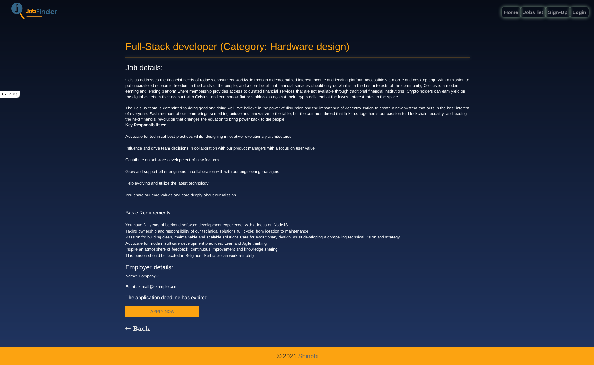
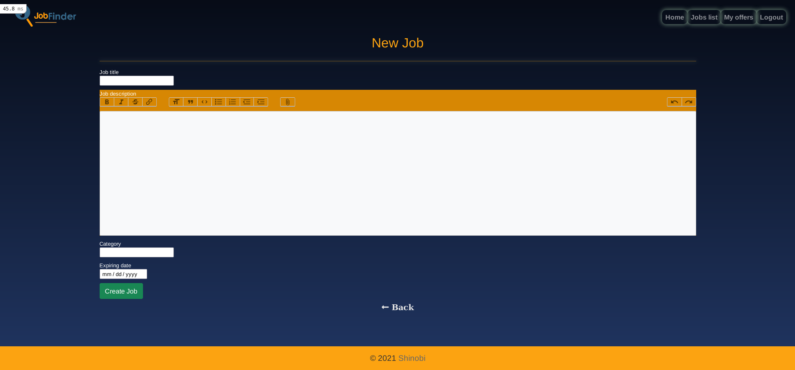

# Job Finder

> This is a job search and a job posting application, through which anyone can apply for a posted job offer, and only logged-in users can create and post new job offers. Once the user applies for the position the Post owner will get an email with user data and the applicant will get the confirmation email.





Additional description about the project and its features.

## Built With

- Ruby v2.7.2
- Ruby on Rails v6.1.4
- Bootstrap 5
- Sass

## Live Demo

[Live Demo Link](https://livedemo.com)


## Getting Started

To get a local copy up and running follow these simple example steps.

### Prerequisites

- Ruby v2.7.2
- Ruby on Rails v6.1.4

### Setup

Clone the repository with:

```
git@github.com:ShinobiWarior/jobfinder.git
```
or download [ZIP file](https://github.com/ShinobiWarior/jobfinder/archive/refs/heads/develop.zip)

### Install

 From the app directory run command: 
```
git checkout development
git pull
```

 Run the following commands to create and migrate databases:
```
rails db:create
rails db:migrate
```
You can use created seeds if you run:
```
rails db:seed
```

### Usage

Now you can open the app on your browser with adress:
```
http://localhost:3000/
```

### Run tests
If you want to test app, run command:
```
rspec
```
## Author

👤 **ALeksandar Ivezic**

- GitHub: [Aleksandar Ivezic](https://github.com/ShinobiWarior)
- Twitter: [@Aivezic](https://twitter.com/Aivezic)
- LinkedIn: [Aleksandar Ivezic](https://www.linkedin.com/in/aleksandar-ivezic/)


## 🤝 Contributing

Contributions, issues, and feature requests are welcome!

Feel free to check the [issues page](https://github.com/ShinobiWarior/jobfinder/issues).

## Show your support

Give a ⭐️ if you like this project!

## 📝 License

This project is [MIT](lic.url) licensed.
